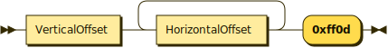

# Brailletec Elotype 5 Graphic Mode driver implementation

This is a Python implementation of a driver for the Brailletec Elotype 5 in graphic mode.

The Elotype 5 is a braille typewriter by Brailetec.
It supports a graphic mode, where it can emboss arbitrary graphics on the paper.
This can be used for tactile graphics as well as for more precise placement of braille characters.

## Contents of this repository

Presently, this repository contains a Python script [emboss_png.py](./emboss_png.py) that can convert a PNG to the Elotype 5 graphic mode wire protocol and send it to the typewriter. Each pixel that is black will be embossed.
Please note: The pixel raster corresponds to the raster of the Elotype 5. The pixels are not square, as the resolution differs between the horizontal and vertical axes.
0x1000 is approximately 12.5 cm in horizontal direction, 0x0300 is approximately 14.9 cm in vertical direction.
You also cannot draw continuous lines, as the Elotype 5 will not emboss them if pixels are placed too close to each other. Though, one embossed dot is multiple times larger than a pixel itself.

Install dependencies with `pip install -r requirements.txt`.

## Wire Protocol

The Elotype is connected to the computer via a USB cable. The Elotype is recognized as a serial device.

The wire protocol is a simple binary protocol. The first byte is always `0x86` to indicate that the print job is in graphic mode.

The following is repeated for each line of the graphic, containing a dot to be embossed. A line begins with a two-byte big endian vertical offset. Then, for each dor to be embossed in the line, a two-byte big endian horizontal offset is given. The line is then terminated with `0xFF 0x0D`. And that's basically it. Representing this as an EBNF grammar yields the following:

```
PrintCommand ::= '0x86' (LineCommand)+
LineCommand ::= VerticalOffset (HorizontalOffset)+ '0xff0d'
VerticalOffset ::= '0x0000 - 0xffff'
HorizontalOffset ::= '0x0000 - 0xffff'
```

### Visualization of EBNF Grammar

Visualized with [RR - Railroad Diagram Generator](https://www.bottlecaps.de/rr/ui):

**PrintCommand:**


**LineCommand:**




**VerticalOffset:**


**HorizontalOffset:**


